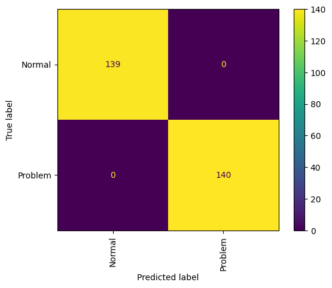

# Budget check for projects (but the approach also work for companies)

## About
The budget check is built from pytorch/tensorflow and demonstrates how a 
deep learning approach facilitates a check to see if a project is on track (without digging into an excell sheet and crunching numbers).

## Deep Learning
The dataset used was approximately 940 normal and problematic budgets (a project may have several project reports at different timepoints). Test size was 279 samples and, deep learning was used on the remaining with validation set of 20%.

The resulting confusion matrix is seen below. 

## Visualing Budget Deviation
To get an idea of whats wrong with the budget a nearest neighbour of correct budgets are calulated and the image shows the different between the budget and nearest correct budget
(nearest neighbour). The resulting is that black is no difference to a correct budget, while a red indicate to low activity in the budget. A green indicator indicates an activity higher than expected.

